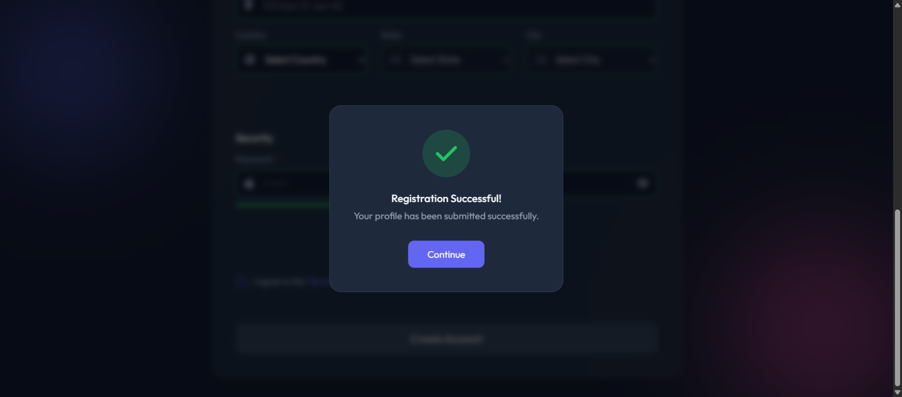
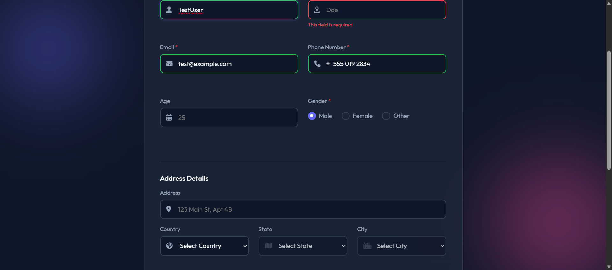
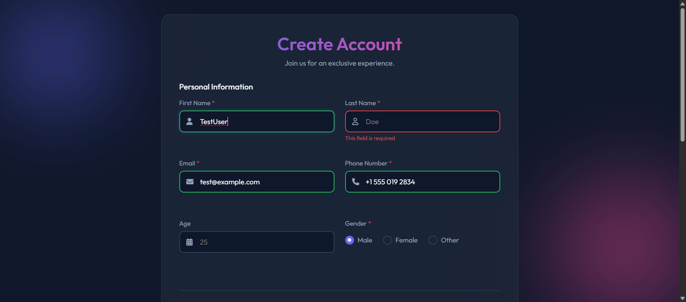

#  Intelligent Registration System | Frugal Testing SE Assignment

GitHub Repository:(https://github.com/shivam89p13-star/frugal-testing-assignment.git)

A modern, responsive registration form with client-side validations and complete Selenium automation testing, developed for the Frugal Testing Software Engineer assignment (Section A, Option 2).



##  Features

###  Form Features
- **Complete Registration Form**: 12+ fields including First Name, Last Name, Email, Phone, Age, Gender, Address, Country/State/City, Password, Confirm Password, and Terms & Conditions
- **Real-time Client-side Validation**: Instant feedback as you type with green (valid) and red (invalid) indicators
- **Disposable Email Blocking**: Prevents registration with temporary email domains (@tempmail.com, mailinator.com)
- **Phone Number Validation**: Automatically validates country codes and format based on selected country
- **Password Strength Meter**: Visual indicator showing password strength as Weak, Medium, or Strong
- **Dynamic Dropdown Cascading**: Country selection automatically updates State options; State selection updates City options
- **Show/Hide Password Toggle**: Eye icons to toggle password visibility for better user experience
- **Success Modal with Animation**: Professional popup modal with checkmark animation upon successful submission
- **Automatic Form Reset**: Form clears all fields and validation states after successful submission
- **Responsive Design**: Fully responsive layout that works perfectly on desktop, tablet, and mobile devices
- **Modern UI/UX**: Dark theme with gradient accents, smooth animations, and intuitive form flow
- **Accessibility Features**: Proper ARIA labels, keyboard navigation, and screen reader support

###  Automation Testing Features
- **Three Comprehensive Test Scenarios**: 
  - Flow A: Negative testing with missing required fields
  - Flow B: Positive testing with valid form submission  
  - Flow C: Form logic testing (dropdown cascading, password validation)
- **Selenium WebDriver Integration**: Automated browser testing with Chrome WebDriver
- **Automatic Screenshot Capture**: Takes screenshots at key test steps (error states, success states)
- **Detailed Test Logging**: Generates timestamped logs of all test execution steps
- **Form Reset Verification**: Automatically verifies form clears after successful submission
- **Dynamic Element Handling**: Robust handling of dynamic dropdowns and validation states
- **Cross-browser Ready**: Easily configurable for Chrome, Firefox, or Edge browsers
- **Error Handling**: Comprehensive exception handling with detailed error messages
- **Headless Mode Support**: Can run tests in background without opening browser window

##  Quick Start

### Prerequisites
- Python 3.7+
- Google Chrome browser

### Installation & Running
1.  **Clone the repository:**
    ```bash
    git clone https://github.com/shivam89p13-star/frugal-testing-assignment.git
    cd frugal-testing-assignment
    ```
2.  **Install Python dependencies:**
    ```bash
    pip install -r requirements.txt
    ```
3.  **View the Registration Form:**
    Open the `index.html` file in your web browser.
4.  **Run the Automation Tests:**
    ```bash
    python automation_script.py
    ```

##  Test Execution & Results

The automated test script (`automation_script.py`) executes three comprehensive flows as per the assignment requirements:

| Test Flow | Objective | Result |
| :--- | :--- | :--- |
| **Flow A** | Negative Scenario - Missing Last Name | ✅ PASS - Submit button correctly disabled, error message displayed. |
| **Flow B** | Positive Scenario - Valid Form Submission | ✅ PASS - Form submits, success modal appears, fields reset. |
| **Flow C** | Logic Validation - Dropdowns, Password Strength | ✅ PASS - Dynamic updates and validation work as expected. |

**Generated Artifacts:**
- **Logs:** Detailed execution log: [`test_logs.txt`](test_logs.txt)
- **Screenshots:** See the [Screenshots](#screenshots) section below.
- **Screen Recording:** **[LINK TO YOUR GOOGLE DRIVE/CLOUD VIDEO HERE]** - A full recording of the automated test execution.

##  Submission Deliverables
This repository contains all required files for the assignment:
- Frontend Code: `index.html`, `style.css`, `script.js`
- Automation Test Suite: `automation_script.py`, `requirements.txt`
- Test Evidence: `test_logs.txt`, `success-state.png`, `error-state.png`, `full-page-error.png`
- Screen Recording: *(Link provided above)*

##  Screenshots
| Error State | Success State | Full Page |
|-------------|---------------|-----------|
|  |  |  |

##  Video Demonstration
[Click here to watch the video demonstration]([https://drive.google.com/file/d/YOUR_FILE_ID/view?usp=sharing](https://drive.google.com/file/d/1-lS5zp7mbmdlit4qs1jwOTVP2Fg8ZY-2/view?usp=sharing))

*The video demonstrates:*
1. Opening the registration form in browser
2. Testing various validations (missing fields, wrong email, etc.)
3. Successful form submission with modal
4. Running automation tests via command line
5. Reviewing generated screenshots and logs


